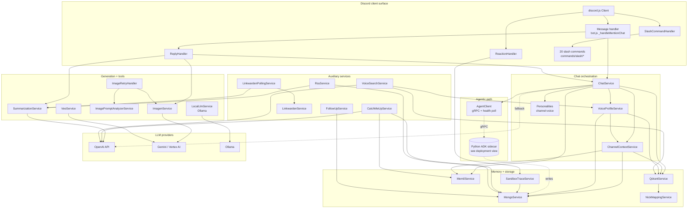
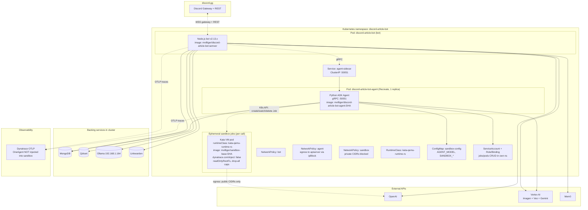
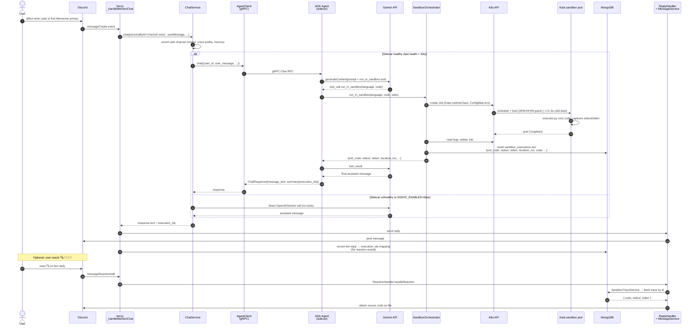

# Architecture

Three views of the Discord Article Bot:

1. [Software architecture](#software-architecture) — modules and their wiring
2. [Deployment architecture](#deployment-architecture) — how it runs on Kubernetes
3. [Channel-voice + sandbox sequence](#channel-voice--sandbox-sequence) — request lifecycle of the agentic path

---

## Software architecture

Modules are grouped by responsibility. Solid arrows are direct in-process calls; the agent boundary is gRPC.

**Wiring notes**
- `ChatService` is the central orchestrator — it owns personality selection, memory enrichment, and the agent-vs-direct routing decision.
- `AgentClient.isHealthy()` is the binary switch: when the sidecar is reachable, channel-voice goes through the agent; otherwise it falls through to direct OpenAI with no user-visible change beyond losing tool use.
- `SandboxTraceService` is lazy-initialized inside `ReactionHandler` so the bot doesn't pay for it when sandbox is disabled.
- Memory has three tiers: in-process buffer (transient) → Qdrant (semantic recall over IRC + channel) → Mem0 (long-lived facts about users/channels).

---

## Deployment architecture

Single Kubernetes namespace (`discord-article-bot`), two long-lived pods, ephemeral sandbox pods spawned on demand.

**Operational invariants**
- **Single-replica `Recreate`** for the agent sidecar — concurrency state is in-process; do not scale.
- **Image pinning** — bot uses semver, agent + sandbox-base use git short-SHA. The `agent-deployment.yaml` enforces a lockstep rule: `containers[0].image` and the `SANDBOX_BASE_IMAGE` env var always carry the same SHA.
- **OneAgent exclusion** — sandbox pods carry `dynatrace.com/inject: "false"`. Without it, OneAgent prevents PID 1 from exiting and inflates per-call wall-clock to ~120s.
- **Private-network egress** is denied by NetworkPolicy by default; new integrations must add explicit ipBlock rules (see `CLAUDE.md`).
- **AGENT_ENABLED=false** flips channel-voice back to direct OpenAI without redeploy.

---

## Channel-voice + sandbox sequence

The happy path of a `@bot` mention in a channel-voice configured channel where the model decides to call `run_in_sandbox`. Direct-OpenAI fallback is shown as a dashed alt branch.

**Key timing + behavior facts**
- **Cold start adds ~1.5–3s per Kata call** — the agent prompt is aware of this so the model doesn't think the call hung.
- **Per-turn budget** is enforced by the agent (`SANDBOX_AGENT_TURN_CALL_BUDGET`) — the model can chain a few sandbox calls per user turn but not run unbounded.
- **Trace retention** — the sidecar's daily loop demotes traces beyond `SANDBOX_TRACE_RETENTION_PER_USER` (default 50) per user: keeps `exit_code`/`stdout`/`stderr`/`duration_ms`, nulls out `code`/`stdin`/`env_keys`/`egress_events`/`runtime_events`/`agent_rationale`.
- **Reaction reveal** — 🔍 returns source, 📜 returns stdout+stderr (when non-empty), 🐛 returns stderr only.
- **Failure modes** — sidecar unreachable, Gemini 4xx (logged via `_summarize_llm_error`), and sandbox Job timeouts all collapse to the dashed alt branch with no user-visible error beyond losing tool output.

---

## Cross-references

- `CLAUDE.md` — deployment workflow, NetworkPolicy rules, the lockstep image-tag rule
- `k8s/sandbox/README.md` — Kata install play-by-play (Helm `--set k8sDistribution=rke2`, RKE2 imports template patch, `kvm_amd sev=0` workaround, `dynatrace.com/inject: false`)
- `features.md` — user-facing feature catalogue
- `flow.md` — earlier message-flow notes (kept for historical context)
