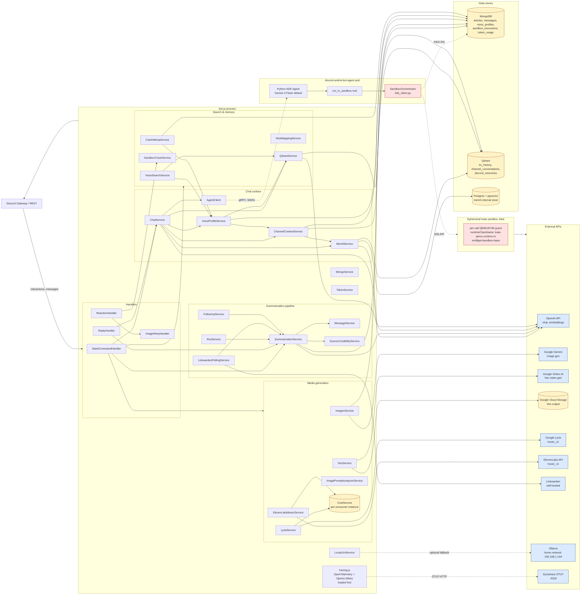
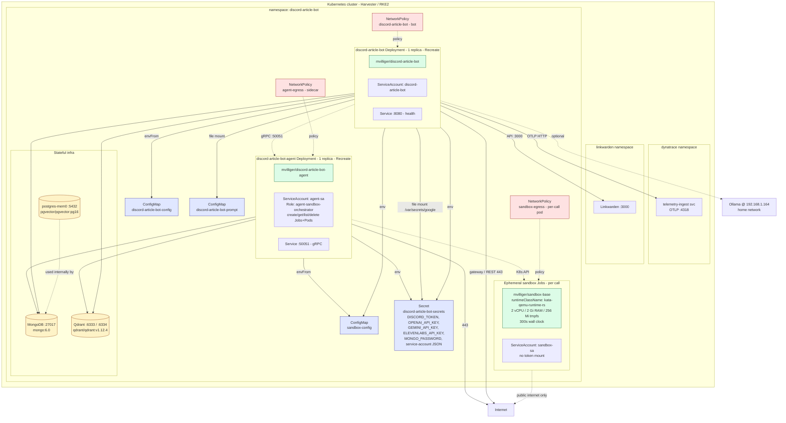

# Architecture

This document is the canonical overview of how the Discord Article Bot is structured. It covers both the runtime software architecture (how Node.js services, the Python agent sidecar, and Discord interact) and the Kubernetes deployment topology (pods, NetworkPolicy egress, secrets, the Kata sandbox runtime).

The diagrams below are Mermaid; they render on GitHub, in most Markdown viewers, and in VS Code with a Mermaid preview extension.

For per-feature documentation see [features.md](../features.md). For deployment commands and operational runbook details see [kubernetes.md](../kubernetes.md) and [k8s/sandbox/README.md](../k8s/sandbox/README.md).

---

## Software architecture

The bot is a single Node.js process (`bot.js`) that orchestrates ~27 services, ~22 slash commands, and 4 event handlers. Optional features (mem0, qdrant, channel context, voice profile, the agent sidecar, each media-gen provider) are guarded behind config flags and skipped cleanly when disabled. All external state lives in three databases.

### Software-flow notes

- **`tracing.js` is required at `bot.js:4` before all other modules.** It wires OpenTelemetry's `@opentelemetry/sdk-node` + `@opentelemetry/auto-instrumentations-node` + `@traceloop/instrumentation-openai` so every LLM call captures full prompt/completion content as span attributes.
- **`channel-voice` is the only personality.** All chat traffic flows through `ChatService.processChatMessage()`, which optionally:
  - prepends channel-context (recent messages in this channel)
  - applies the voice profile (group communication style learned from IRC + Discord history)
  - injects 3-way mem0 memories (per-user, per-channel-shared, personality-scoped)
  - routes through `AgentClient` (gRPC to the Python sidecar) when `AGENT_ENABLED=true` and the sidecar is healthy, falling through to direct OpenAI when not
- **Each media-gen service owns its own `CostService` instance.** Per-call costs are surfaced in pod log lines; the `/stats` Discord command reads MongoDB's `token_usage` collection and does not yet surface media-gen rows (see Approach B in `features.md`).
- **Slash commands take services as constructor args** so the same service can be invoked from `bot.js` boot wiring (real services) or from `scripts/registerCommands.js` (passes `null` because it only needs the schema).
- **`SandboxTraceService`** is a read-side companion to the agent sidecar's write path. The agent writes a doc into MongoDB `sandbox_executions` per `run_in_sandbox` call; `ReactionHandler` watches for 🔍 / 📜 / 🐛 reactions on bot replies and asks `SandboxTraceService` for the corresponding artifact.

### When you toggle features

| Flag | Disabling means |
|---|---|
| `AGENT_ENABLED=false` | Channel-voice chats route directly to OpenAI; `run_in_sandbox` is unavailable. The bot does not need the sidecar pod running. |
| `MEM0_ENABLED=false` | No long-term memory; the bot still chats but won't remember anything across sessions. |
| `QDRANT_IRC_ENABLED=false` | `/recall`, `/history`, `/throwback`, voice-informed search, voice profile sampling all go offline. Bot still runs. |
| `CHANNEL_CONTEXT_ENABLED=false` | No passive channel awareness; chats only see their own conversation history. |
| `IMAGEGEN_ENABLED`, `VEO_ENABLED`, `MUSICGEN_ENABLED`, `ELEVENMUSIC_ENABLED` | Each unhooks one slash command and one service. |
| `LINKWARDEN_ENABLED=false` | No article-archive polling; `/summarize` still works with direct URL fetches. |
| `RSS_FEEDS_ENABLED=false` | No automated feed posting. |
| `LOCAL_LLM_ENABLED=false` | No Ollama fallback; cloud-only. |

---

## Deployment architecture

Everything lives in the `discord-article-bot` Kubernetes namespace. The single bot pod, the single agent sidecar pod, ephemeral Kata sandbox Jobs, and three infrastructure pods (MongoDB, Qdrant, Postgres) make up the namespace footprint at steady state.

### Deployment notes

- **Image lockstep.** Every deploy pins image tags to git short-SHAs (project rule: no `:latest`). The agent sidecar image (`discord-article-bot-agent`) and the sandbox base image (`sandbox-base`) move in lockstep — both must be rebuilt and bumped together when either changes.
- **`k8s/overlays/deployed/` is gitignored.** It's the live source-of-truth for what's running. Tracked manifests live in `k8s/sandbox/` (agent + sandbox parts) — see [`k8s/sandbox/README.md`](../k8s/sandbox/README.md) for the Kata install play-by-play.
- **Sandbox isolation is Kata, not gVisor.** Originally specified as gVisor; switched to `kata-qemu-runtime-rs` (Kata's Rust runtime, statically linked) on 2026-04-29 because Harvester's immutable SLE Micro OS makes `runsc` installation impractical, and KubeVirt-on-bare-metal is the platform's native model. Each `run_in_sandbox` call spawns a Kubernetes Job whose pod boots a tiny QEMU/KVM guest, runs the workload, and is torn down. Cold start: ~1.5–3s per call.
- **Sandbox pods carry `dynatrace.com/inject: "false"`.** Without this annotation, OneAgent injection holds PID 1 and ballooned wall-clock-per-execution to ~120s. The annotation is in the sandbox Job template.
- **NetworkPolicy egress posture.**
  - **Bot pod**: DNS, MongoDB:27017, Qdrant:6333/6334, agent sidecar:50051, Dynatrace OTLP:4317/4318, Linkwarden:3000, Ollama @ `192.168.1.164:11434`, public internet 80/443 (with RFC1918 explicitly denied)
  - **Agent sidecar**: DNS, MongoDB, Qdrant, K8s API server (`10.53.0.1` ClusterIP and control-plane IPs on 443/6443), public internet :443 (RFC1918 denied)
  - **Sandbox pods**: DNS + public internet :80/:443 only — every RFC1918 range is denied, including the cluster's own pod CIDR (`10.52/16`), service CIDR (`10.53/16`), the host network, and the K8s API itself
- **Single-replica `Recreate` strategy** on both the bot and the agent sidecar. The bot's conversation state and the sidecar's concurrency limits are in-process — do not scale either to >1 replica.

---

## Open architectural follow-ups

These are flagged in `features.md` and across the now-archived superpowers specs (`done-todos/2026-05-15-*.md`). The biggest is **Approach B**, which has been deferred through three feature ships and is now the standing follow-up.

- **Approach B — `MediaGenBase` refactor.** `ImagenService`, `VeoService`, `LyriaService`, and `ElevenLabsMusicService` duplicate noticeable plumbing (enabled checks, error shaping, attachment handling, per-call cost override). Lift the common bits into a base class. While doing this, hoist a single `CostService` instance into `bot.js` and inject it into every consumer (today each media-gen service constructs its own), so cumulative cost figures are unified.
- **MongoDB-backed media-gen records for `/stats`.** Today `/stats` reads `token_usage` and does not include flat-fee media-gen rows. Wire media-gen records into MongoDB so they appear in `/stats` alongside token costs.
- **OpenTelemetry SDK major bump.** `@opentelemetry/auto-instrumentations-node` (0.52.x) and `@opentelemetry/sdk-node` (0.56.x) have a high-severity advisory (GHSA-q7rr-3cgh-j5r3) that requires a coordinated major bump. Deferred from PR #76.
- **`@tootallnate/once` chain.** Pulled by `@google-cloud/storage` → `teeny-request` → `http-proxy-agent@5`. Fixing requires either an override that breaks `http-proxy-agent@5`'s peer range or downgrading `@google-cloud/storage` 7.x → 5.x. Deferred from PR #76.
- **Slash-command unit tests.** No existing pattern under `__tests__/commands/slash/`. Slash commands are smoke-tested manually in Discord today.
- **MediaGen integration checklist.** PR #79 hit a deploy trap: `secret.yaml` got the new key but `deployment.yaml` was missing the `valueFrom: secretKeyRef` binding needed to expose the env var to the pod. Adding a "files to touch when adding a new secret-backed service" checklist to the implementer notes for the next media-gen plan would catch this.
- **Voice-profile regen-pipeline hardening.** The local prompt-tuning tool at `scripts/prompt-tuning/` (see [`scripts/prompt-tuning/README.md`](../scripts/prompt-tuning/README.md)) lets you iterate on the `personalities/channel-voice.js` template offline and commit when satisfied. The longer-term regen-pipeline improvements (synthesis prompt tightening, topic-bleed filter on the auto-generated voice profile, eval-gated rotation) are still outstanding — addressed when we want continuous quality rather than periodic manual tuning.
